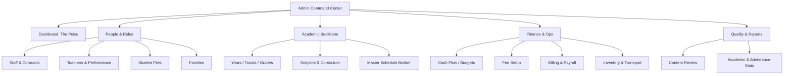
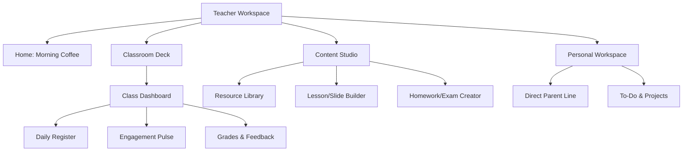
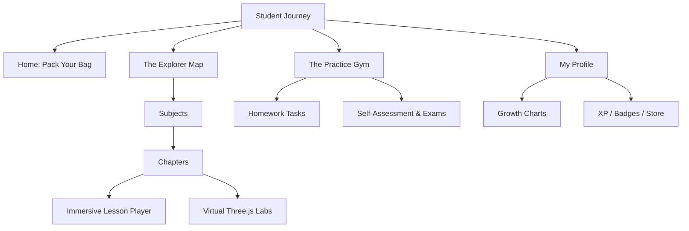
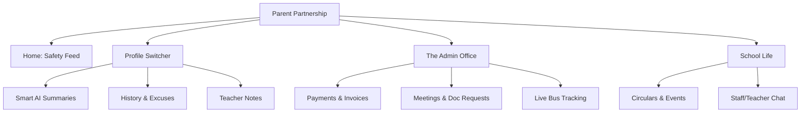

# Madrasti 2.0: Visual Project Structure

This document provides a visual representation of the ideal sitemap for each role, designed to match the strategic workflows.

---

## 🛡️ Admin Portal Sitemap

---

## 👩‍🏫 Teacher Portal Sitemap

---

## 🎒 Student Portal Sitemap

---

## 👨‍👩‍👧‍👦 Parent Portal Sitemap

